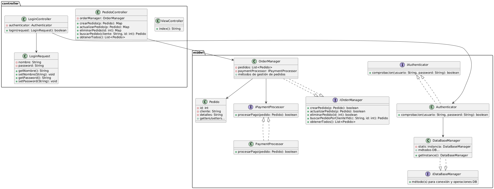
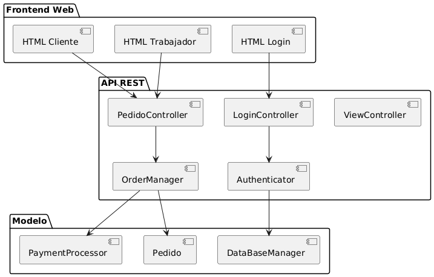
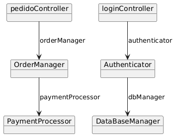

# 🍕 Gestión Pizza Di Mama

Sistema de gestión de pedidos para una pizzería, desarrollado en Java siguiendo una arquitectura basada en los principios SOLID. Esta aplicación permite realizar pedidos, verificar su estado y gestionarlos desde el lado del trabajador, todo a través de una interfaz web sencilla y funcional.

---

## 🚀 Características

- Realización de pedidos por parte de clientes.
- Revisión de pedidos ingresando nombre e ID.
- Gestión del estado de pedidos por parte de trabajadores.
- Eliminación de pedidos realizados.
- Simulación de pagos y autenticación.
- Diseño extensible y mantenible.

---

## 🛠️ Tecnologías

- Java 21
- Maven
- Spring Boot (estructura)
- HTML + CSS (cliente/trabajador)
- Arquitectura MVC
- Diseño SOLID con interfaces e inyección de dependencias
- MySQL / MariaDB (opcional)

---

## 🧠 Principios SOLID aplicados

### ✅ S - Single Responsibility Principle (Responsabilidad Única)

Cada clase tiene una única responsabilidad:
- `PedidoController`: peticiones web de pedidos.
- `LoginController`: manejo de inicio de sesión.
- `OrderManager`: lógica de negocio de pedidos.
- `PaymentProcessor`: procesamiento simulado de pagos.
- `DataBaseManager`: acceso a los datos.
- `Authenticator`: lógica de autenticación.

👉 Esto facilita el mantenimiento y la evolución de cada módulo por separado.

---

### ✅ O - Open/Closed Principle (Abierto/Cerrado)

Uso de interfaces para permitir extensión sin modificar código existente:
- `IOrderManager`, `IDataBaseManager`, `IAuthenticator`, `IPaymentProcessor`.
- Las clases concretas implementan estas interfaces y pueden ser reemplazadas fácilmente.

🧩 Ejemplo: puedes implementar una nueva clase de base de datos real sin modificar `DataBaseManager`.

---

### ✅ L - Liskov Substitution Principle

Todas las implementaciones pueden sustituir sin romper el sistema:
- Ej: puedes sustituir `OrderManager` por otra implementación de `IOrderManager` sin que el sistema falle.

✅ Esto hace que el sistema sea fácilmente testable, intercambiable y confiable.

---

### ✅ I - Interface Segregation Principle

Interfaces pequeñas y específicas para cada rol del sistema:
- `IOrderManager` para pedidos.
- `IAuthenticator` para autenticación.
- `IPaymentProcessor` para pagos.

👉 No se obliga a ninguna clase a implementar métodos que no usa, manteniendo el sistema limpio.

---

### ✅ D - Dependency Inversion Principle

Las clases de alto nivel dependen de abstracciones:
- `PedidoController` depende de `IOrderManager`, no de `OrderManager`.
- `OrderManager` depende de `IDataBaseManager`, no de `DataBaseManager`.

✅ Esto promueve un diseño desacoplado, ideal para testing, cambios o escalabilidad.

---

## 📁 Estructura del Proyecto


Diagrama de Clases:





Diagrama de Componentes:





Diagrama de Objetos:





## 🧩 Instalación y Configuración de Base de Datos

### 📦 Requisitos

- Java 21+
- Maven
- MySQL o MariaDB
- IDE (IntelliJ IDEA, VSCode, etc.)

---

### ⚙️ Configuración de la Base de Datos

1. Abre tu terminal y accede a tu servidor MySQL:
   ```bash
   mysql -u tu_usuario -p
   ```
   
2.  Crea la base de datos:
   ```sql
   CREATE DATABASE pizzeriaDiMama;
   USE pizzeriaDiMama;
   ```

3. Importa el archivo sql con la estructura de la base de datos:
   ```sql
   mysql -u tu_usuario -p pizzeriaDiMama < pizzeriaDiMama.sql
   ```
   
4. Verifica que la tabla `pedidos` se haya creado correctamente:
   ```sql
    SELECT * FROM pedidos;
    ```

- Deberías ver una tabla vacía con las columnas `id`, `nombre`, `estado` y `precio`.

### Datos importantes

- En la tabla trabajadores, los datos de usuario y contraseña serviran para iniciar sesión en la aplicación. Muestro ejemplo:
  - Usuario: `Yoel`
  - Contraseña: `1234`
  - Con estas credenciales podrás iniciar sesión como trabajador y gestionar los pedidos.


### Dudas

Si tienes dudas sobre la instalación o configuración, no dudes en abrir un issue en el repositorio o contactarme directamente: yurqubar@myuax.com.